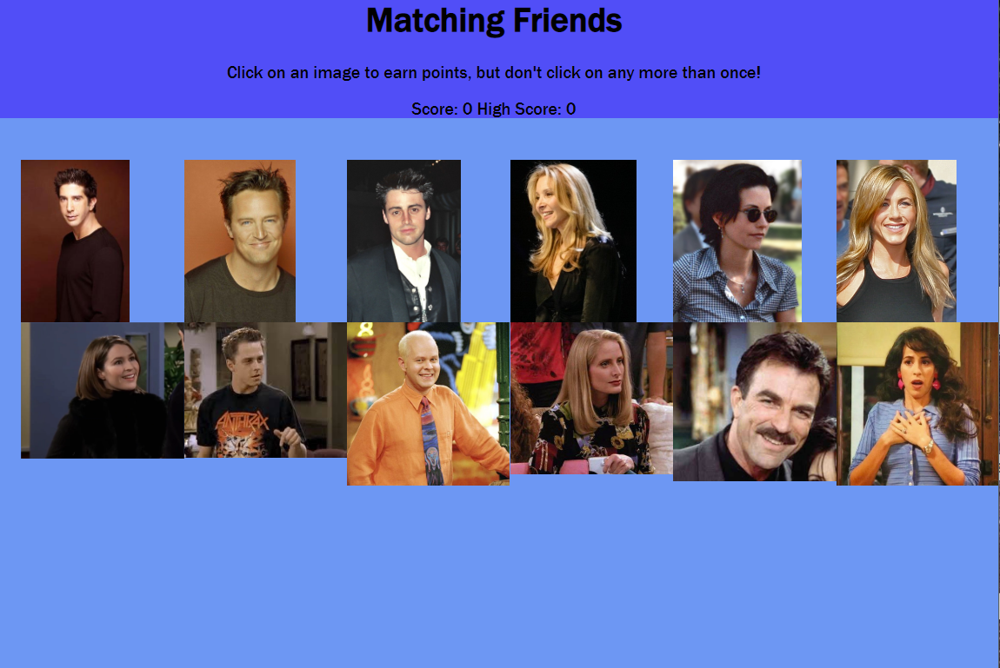

# Remember-To-React
Friends themed memory game built in [React](https://reactjs.org/ "React")!

## Check it out
* `Remember-To-React` is a memory game built in React.js. 
* To win the game, the player has to click on each of the cast member's cards without clicking the same one twice.
* To create another level of difficulty, every click shuffles the cards in a new order to choose again. 
* Will you remember which one you chose last?

Play the example to find out:[https://remember-to-react-nine-rouge.now.sh/]

## Try it out:
* [Clone](https://help.github.com/en/github/creating-cloning-and-archiving-repositories/cloning-a-repository "Help me Clone a Repository") the repository from the clone tab above
* Open a terminal and change directory to Desktop
* Clone to Desktop
* Change directory to the new folder
* In terminal, type `yarn i` or `npm i` depending on what you are using
* In terminal, type `yarn start` or `npm start` to run on localhost
